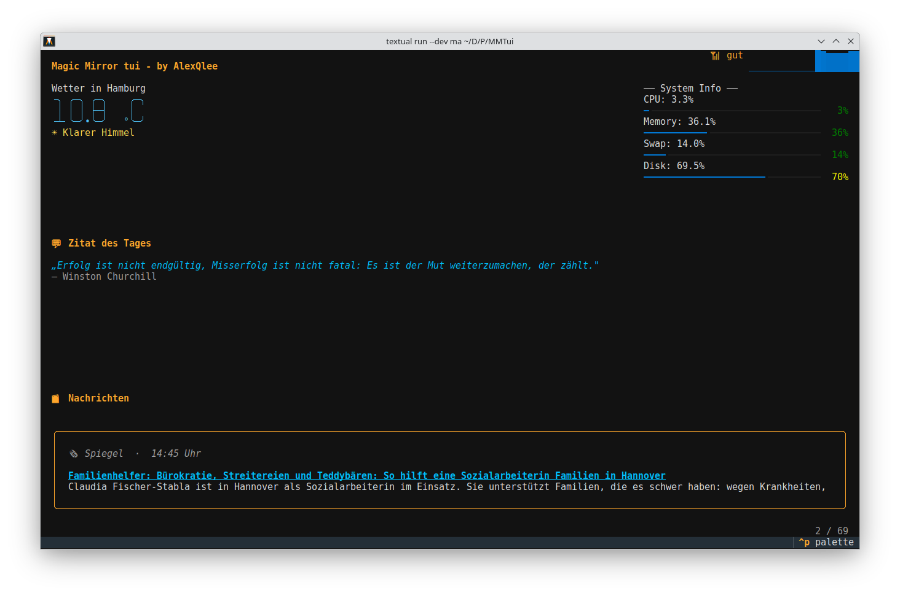

# MagicMirror TUI

A terminal-based Magic Mirror built with [Textual](https://textual.textualize.io/) – inspired by the classic [MagicMirror²](https://magicmirror.builders/) project, but running directly in your terminal.



---

## ✨ Features

- **🌤 Weather** – Live weather data via OpenWeatherMap API (temperature, description, color-coded)
- **🖥 System Info** – CPU, RAM, swap, and disk usage as real-time progress bars
- **📰 News** – RSS feed carousel (configurable sources) with automatic SQLite caching
- **💬 Quote of the Day** – Daily rotating quote, fetched from an API and stored locally
- **📅 Calendar** – Local event management with countdown display (today / tomorrow / in X days)
- **📶 WiFi Status** – Signal strength as a sparkline graph in the header

---

## 🛠 Technologies

- [Textual](https://textual.textualize.io/) – TUI framework
- [psutil](https://pypi.org/project/psutil/) – System metrics
- [requests](https://pypi.org/project/requests/) – HTTP requests
- [SQLite](https://www.sqlite.org/) – Local caching & data storage
- [OpenWeatherMap API](https://openweathermap.org/api) – Weather data
- [quotable.io](https://api.quotable.io) / [ZenQuotes](https://zenquotes.io) – Quotes

---

## 🚀 Installation

**Python 3.12.x is recommended – psutil may fail on Python 3.14.x.**

```bash
git clone https://github.com/AlexQlee/magicmirror-tui
cd magicmirror-tui
pip install -r requirements.txt
```

Copy the example config and fill in your settings:

```bash
cp config.example.json config.json
```

Then run:

```bash
python main.py
```

---

## ⚙️ Configuration

All settings are managed in `config.json`. Each module has an `enabled` flag to turn it on or off.

```json
{
  "modules": {
    "header":      { ... },
    "weather":     { ... },
    "system_info": { ... },
    "quote":       { ... },
    "news":        { ... },
    "calendar":    { ... }
  }
}
```

### `header`

| Key | Type | Default | Description |
|---|---|---|---|
| `enabled` | bool | `true` | Show/hide the header bar |
| `update_interval` | int (s) | `2` | How often the WiFi signal is refreshed |

### `weather`

| Key | Type | Default | Description |
|---|---|---|---|
| `enabled` | bool | `true` | Show/hide the weather widget |
| `api_key` | string | — | Your [OpenWeatherMap](https://openweathermap.org/) API key (**required**) |
| `lat` | float | `53.5507` | Latitude of the location |
| `lon` | float | `9.993` | Longitude of the location |
| `update_interval` | int (s) | `1800` | How often weather data is refreshed (default: 30 min) |

### `system_info`

| Key | Type | Default | Description |
|---|---|---|---|
| `enabled` | bool | `true` | Show/hide the system info widget |
| `disks` | list of strings | `["/", "/home"]` | Disk mount points to monitor |
| `update_interval` | int (s) | `1` | How often system metrics are refreshed |

### `quote`

| Key | Type | Default | Description |
|---|---|---|---|
| `enabled` | bool | `true` | Show/hide the quote widget |
| `language` | string | `"de"` | Language for the quotable.io API (`"de"`, `"en"`, …) |
| `update_interval` | int (s) | `86400` | How often a new quote is fetched (default: 24 h) |

### `news`

| Key | Type | Default | Description |
|---|---|---|---|
| `enabled` | bool | `true` | Show/hide the news widget |
| `feeds` | object | n-tv + Spiegel | RSS feed sources as `{ "Name": "URL" }` pairs |
| `carousel_interval` | int (s) | `20` | How often the displayed article rotates |
| `cache_refresh_interval` | int (s) | `900` | How often feeds are re-fetched (default: 15 min) |

### `calendar`

| Key | Type | Default | Description |
|---|---|---|---|
| `enabled` | bool | `false` | Show/hide the calendar widget (currently disabled) |

### Full example

```json
{
  "modules": {
    "header": {
      "enabled": true,
      "update_interval": 2
    },
    "weather": {
      "enabled": true,
      "api_key": "YOUR_OPENWEATHERMAP_API_KEY",
      "lat": 53.5507,
      "lon": 9.993,
      "update_interval": 1800
    },
    "system_info": {
      "enabled": true,
      "update_interval": 1,
      "disks": ["/", "/home"]
    },
    "quote": {
      "enabled": true,
      "language": "de",
      "update_interval": 86400
    },
    "news": {
      "enabled": true,
      "feeds": {
        "n-tv": "https://www.n-tv.de/rss",
        "Spiegel": "https://www.spiegel.de/schlagzeilen/tops/index.rss"
      },
      "carousel_interval": 20,
      "cache_refresh_interval": 900
    },
    "calendar": {
      "enabled": false
    }
  }
}
```

---

## 📝 License

MIT License – feel free to use and modify.
